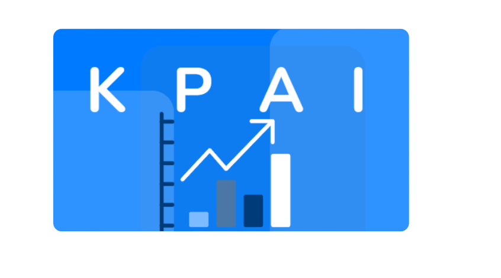

## Overview

**KPAI** is a FastAPI-based web application that integrates the Mistral language model via LangChain to generate Key Performance Indicators (KPIs) dynamically based on a user's profile and project details. The app provides a set of API endpoints that allow users to interact with the system, create profiles, manage projects, and receive customized KPI generation. Additionally, it includes functionality to store and retrieve user data from a MySQL database.

## Features

- **User Profile Management**: Users can create and update profiles with details like position, department, and sector.
- **Project Management**: Users can associate projects with their profiles.
- **Dynamic KPI Generation**: Generate customized KPIs based on the user's role, department, sector, and project using the Mistral model and LangChain.
- **Session Management**: Sessions are created to track user activity and facilitate the generation of KPIs and questions.
- **Database Storage**: User profiles, projects, questions, and answers are stored in a MySQL database.

## Technologies

- **FastAPI**: Web framework used to build the API.
- **LangChain**: A library used for chaining LLM models with data parsers, used here to handle the generation of KPIs.
- **Mistral**: A language model accessed via LangChain to generate the necessary KPIs and responses.
- **Pydantic**: Used for data validation and defining structured output models for the KPIs.
- **MySQL**: Relational database used for storing user data, profiles, projects, questions, and answers.
- **Dotenv**: For environment variable management.

## Installation

The application can be installed using Docker. 

1. **Docker Setup**: 

   Pull the Docker image with the following command:

   ```bash
   docker pull nachompra/kpi-chat-app:v2.3
Please contact me for the docker run required credentials.

